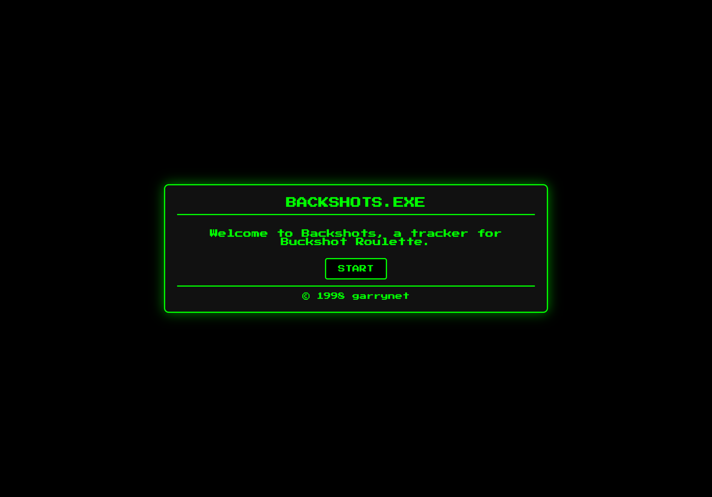
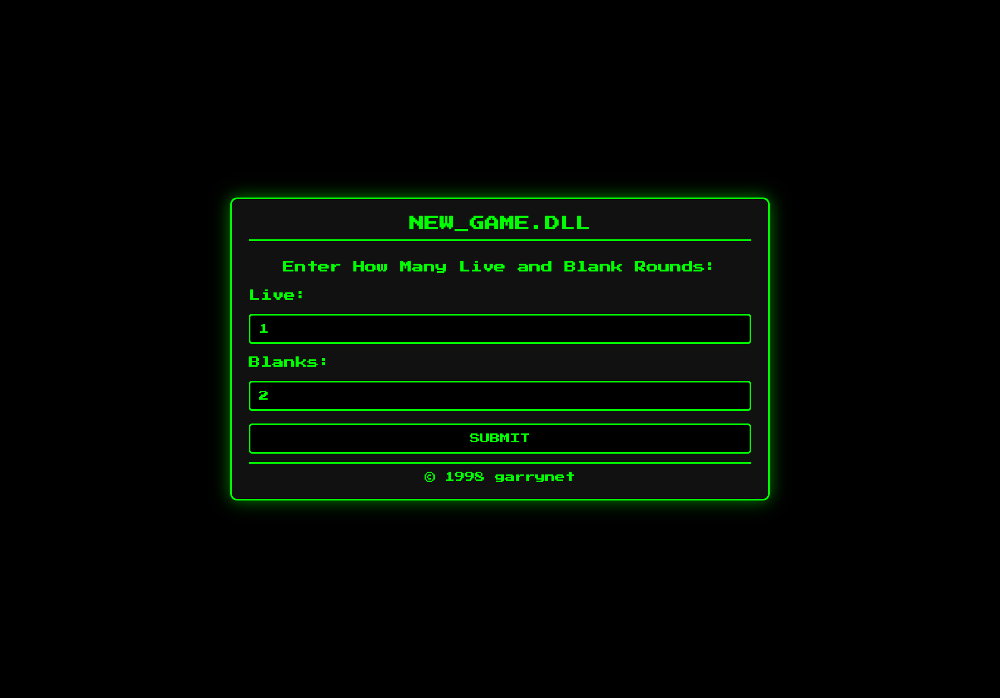
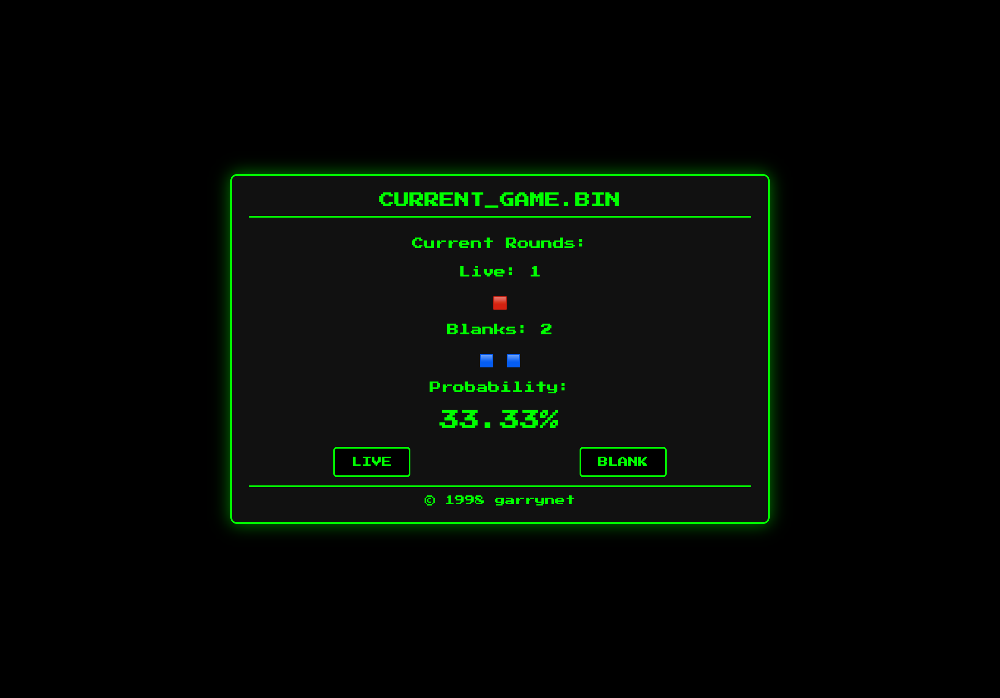

# 🎯 Backshots


## 👀 Overview

A tracker web app for Buckshot Roulette, designed to compensate for my poor short-term memory and math skills. It’s also perfect for players aiming to 100% the game or for tryhards looking to dominate multiplayer and annoy their friends.

## 📸 Screenshots





## 🔧 Setup

To run this app locally, follow these steps:

1. Create and activate a virtual environment

```zsh
python3 -m venv .venv
source .venv/bin/activate
```

2. Install required libraries

```zsh
pip install -r requirements.txt
```

3. Run the app

```zsh
chmod +x run.sh
./run.sh
```

4. Open browser and go to `http://localhost:8080`

5. Enjoy.

> To stop server just hit `ctrl+c` in the terminal where it's open
